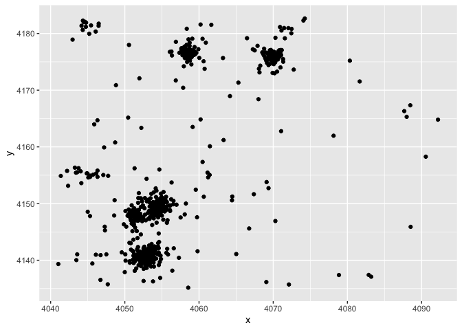
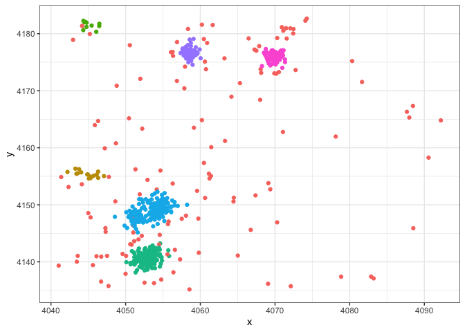
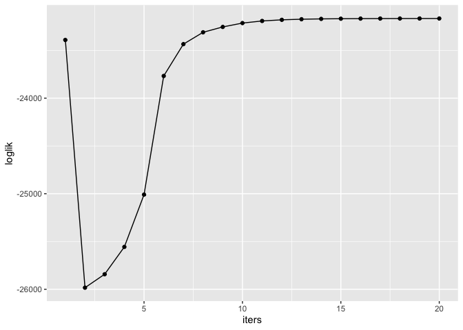
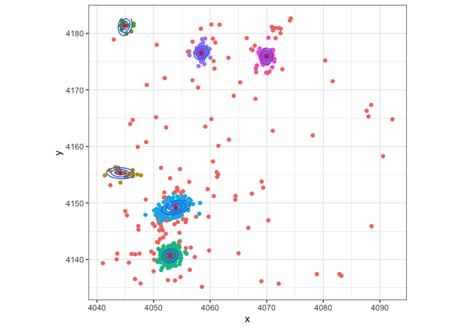
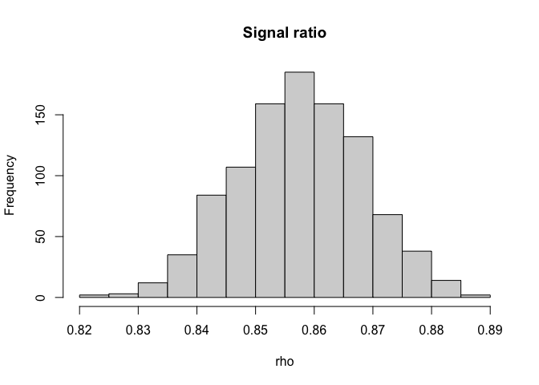
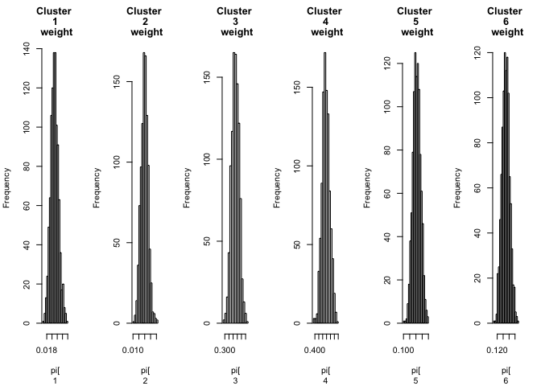
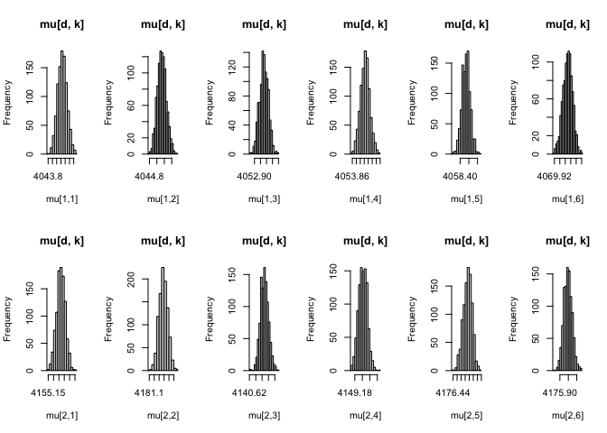
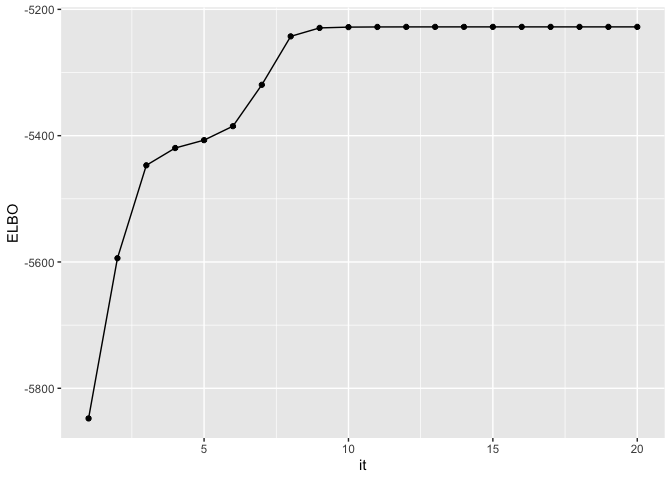
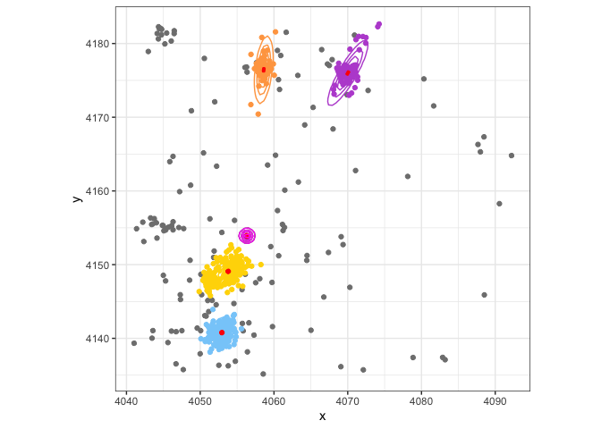

-   [Prepare & plot Chandra dataset](#prepare-plot-chandra-dataset)
-   [Mixture of Finite Gaussian Mixture Model and Uniform
    Background](#mixture-of-finite-gaussian-mixture-model-and-uniform-background)
    -   [Inference Algorithm 1: EM
        algorithm](#inference-algorithm-1-em-algorithm)
    -   [Inference Algorithm 2: Gibbs
        Sampler](#inference-algorithm-2-gibbs-sampler)
    -   [Inference Algorithm 3: VI
        Algorithm](#inference-algorithm-3-vi-algorithm)

Prepare & plot Chandra dataset
==============================

``` {.r}
# libraries
require(ggplot2)
```

    ## Loading required package: ggplot2

``` {.r}
require(mvtnorm)
```

    ## Loading required package: mvtnorm

``` {.r}
require(CholWishart)
```

    ## Loading required package: CholWishart

``` {.r}
# source the codes
Rcpp::sourceCpp('utils/helpers.cpp')
source('utils/visualisation.R')
source('utils/helpers.R')

load('data/chandrasubset.RData')
rm(list=ls()[! ls() %in% c("spatial")])
data = list(X = spatial)
```

``` {.r}
# plot data
data <- list(X = spatial[1:1000,])
ggplot() + geom_point(data = data.frame(x = data$X[,1], y = data$X[,2]), aes(x, y)) 
```



Mixture of Finite Gaussian Mixture Model and Uniform Background
===============================================================

Inference Algorithm 1: EM algorithm
-----------------------------------

``` {.r}
# source the codes
source('em/_em_component.R')
source('em/_em_mixture.R')
source('em/_em_mmsignal.R')
source('utils/helpers.R')
source('utils/visualisation.R')
```

``` {.r}
# prepare to run EM
X = as.matrix(data$X)
Ks = 6

# intialize the em paramters
s = rep(1, nrow(X))
z = kmeans(x = X, Ks + 1)$cluster
m_init = matrix(rep(apply(X, 2, min), Ks), nrow = dim(X)[2] )
m_init[, 1] = c(4042, 4155)
m_init[, 2] = c(4045, 4180)
m_init[, 3] = c(4055, 4140)
m_init[, 4] = c(4055, 4150)
m_init[, 5] = c(4055, 4175)
m_init[, 6] = c(4070, 4180)


gem_init_pars = get_EMNormComponent_example_init_pars(2)
gem_init_pars$m_init = m_init

chandra = EMMixSigAndBg(Ks = Ks, D = 2, X = X, s = s, z = z,
               sig_componentClass = EMNormComponent, sig_init_pars = gem_init_pars)
  
# run EM
niters = 20

loglik <- rep(0, niters)
for(i in 1:niters) {
  if (i == 1 || i %% 5 == 0 ) {
    print(paste(c('iter:', i)))
  }
    
  chandra$em_update()
  loglik[i] <- chandra$get_loglik()
}
```

``` {.r}
# plot out the inference result
print(plot_2D_MM_signal(chandra))
```



``` {.r}
print(plot_em_loglik(loglik))
```



Inference Algorithm 2: Gibbs Sampler
------------------------------------

``` {.r}
source('finite_gibbs/_component.R')
source('finite_gibbs/_mixture.R')
source('finite_gibbs/_fmmsignal.R')
source('utils/helpers.R')
source('utils/visualisation.R')
Rcpp::sourceCpp('utils/helpers.cpp')
```

``` {.r}
load('data/em_init.RData')

# prepare to run Gibbs
set.seed(0)
X = as.matrix(data$X)
Ks = 6
Kb = 1

gmm_init_pars = get_GMVNComponent_example_init_pars(2)
m_init = matrix(rep(apply(X, 2, min), Ks), nrow = dim(X)[2] )
m_init[, 1] = c(4045, 4158)
m_init[, 2] = c(4045, 4185)
m_init[, 3] = c(4055, 4140)
m_init[, 4] = c(4055, 4150)
m_init[, 5] = c(4055, 4175)
m_init[, 6] = c(4070, 4180)

gmm_init_pars$m_init = m_init
gmm_init_pars$S0 = 9 * gmm_init_pars$S0
  
# initialize with em run
bz = rep(0, nrow(X))
s = em_init$s
z = em_init$z

chandra = Mixture(Ks = Ks, Kb = Kb, D = 2, X = X, s = s, sz = z, bz = bz,
               sig_componentClass = GMVNComponent, sig_init_pars = gmm_init_pars)
  
# run Gibbs
niters = 20
for(i in 1:niters) {
  if (i == 1 || i %% 5 == 0 ) {
      print(paste(c('iter:', i)))
      for(k in 1:Ks) {
        print(paste(c('Signal cluster k size:', chandra$signal[[1]]$components[[k]]$N)))
      }
    }
    
  chandra$gibbs()
}
```

``` {.r}
# plot out the last iteration result
print(plot_2D_GMM_signal(chandra, chandra$signal[[1]]$z))
```



``` {.r}
# plot posterior
post_samp = sample_post(chandra)
output <- sample_theta(k = 6, post_samp$X, post_samp$z, post_samp$K)
print(hist_rho(post_samp$rho))
```



    ## NULL

``` {.r}
print(hist_pi(output$pi))
```



    ## NULL

``` {.r}
print(hist_mu(output$mu, data$mu))
```



    ## NULL

Inference Algorithm 3: VI Algorithm
-----------------------------------

``` {.r}
source('vb/vi_gmm.R')
source('utils/helpers.R')
source('utils/visualisation.R')
```

``` {.r}
set.seed(0)
K = 6
D = 2

# intialize VI algorithm at random
chandra <- vb_gmm(data$X, K = 6, epsilon_conv = 1e-4)
```

``` {.r}
ggplot(data.frame(it = 1: length(chandra$L), ELBO = chandra$L)) + 
  geom_line(aes(it, ELBO)) + geom_point(aes(it, ELBO))
```



``` {.r}
# visualize cluster at convergence
res = make_visual_obj_from_vb(chandra, data$X)
visualize_result(res, res$X, res$K, res$bg_lower, res$bg_upper)
```


